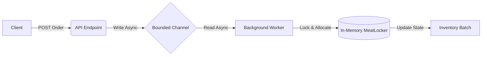

# 🥓 FreshStream (The "Baconator" API)
**High-Concurrency Perishable Inventory Engine**

> **Concept:** A .NET 9 Web API designed to handle high-velocity order ingestion for perishable goods (Pork) using a **FEFO (First Expired, First Out)** allocation strategy.

## 🎯 The Problem
In food processing, standard inventory algorithms (FIFO/LIFO) could arguably result in spoilage (and therefore revenue loss). Additionally, during high-volume sales events, synchronous API processing can cause race conditions where inventory is oversold (two orders coming in at exactly the same time for limited inventory could create an oversell, e.g. two orders for 50lbs of inventory, when **only** 50lbs remain).

## 💡 The Solution
**Baconator** is an asynchronous backend service that decouples **Order Ingestion** from **Inventory Processing**.
* **Zero-Blocking:** The API accepts orders instantly (`202 Accepted`) and offloads processing to a background worker.
* **Spoilage Reduction:** Implements a **FEFO algorithm** to automatically allocate the oldest valid inventory first.
* **Thread Safety:** Implements in-memory ACID transaction logic via rigorous locking, ensuring that availability checks and inventory deductions occur as an atomic operation.

---

## 🏗 Architecture

The system utilizes a **Producer/Consumer** pattern using `System.Threading.Channels` to handle backpressure and ensure API stability.



---

## 🚀 Getting Started

Follow these steps to get the application running on your local machine.

### Prerequisites
* **.NET 9 SDK** (or newer)
* **Git**
* **PowerShell** (Optional: Required only if you want to run the automated stress test)

### Installation & Setup

1. **Clone the Repository**
   Open your terminal and run the following command to download the code:
   ```bash
   git clone [https://github.com/skycodepilot/Baconator.git](https://github.com/skycodepilot/Baconator.git)
   cd Baconator
   ```

2. **Restore Dependencies & Build**
   Pull down the necessary NuGet packages and compile the solution:
   ```bash
   dotnet restore
   dotnet build
   ```

3. **Run the API**
   Navigate to the API project folder and start the server:
   ```bash
   cd Baconator.Api
   dotnet run
   ```
   *The API will start listening. Look for the port number in the terminal output (usually `http://localhost:5xxx`).*

---

## 🎮 How to Use

### Option 1: The "Smoke Test" (Automated)
I have included a PowerShell script (`stress-test.ps1`) to simulate a high-velocity sales event. This script:
1.  Stocks the inventory with 1,000 lbs of product.
2.  Fires **50 concurrent orders** to test the async queuing and locking logic.

Open a **new** terminal window (keep the API running in the first one, **and ensuring the ps1 file above has the CORRECT localhost address**) and run:
```powershell
./stress-test.ps1
```

### Option 2: Manual Testing (Swagger UI)
If running in a Development environment, you can use the Swagger UI:
1.  Open your browser to `http://localhost:5xxx/swagger`.
2.  Use **POST /api/inventory** to add stock.
3.  Use **POST /api/orders** to place orders.
4.  Use **GET /api/inventory** to see the real-time FEFO logic in action.

---

## 🧪 Testing
The solution includes a Unit Test suite to verify the FEFO (First Expired, First Out) logic ensures older inventory is always prioritized.

To run the tests:
```bash
cd ../Baconator.Tests
dotnet test
```

---

## 🧠 Design Decisions & Trade-offs

### Why `System.Threading.Channels`?
Instead of an external message broker (RabbitMQ/Kafka), I used in-memory Channels for this micro-service to minimize infrastructure overhead while maintaining strict ordering and backpressure handling. This prevents `OutofMemory` exceptions if the API is flooded.

### Why `lock` over `ConcurrentBag`?
While concurrent collections are faster for simple adds, our business logic requires a **transactional** check: *Check total availability -> Sort by Date -> Deduct*. This multi-step operation must be atomic. A standard `lock` ensures that no two orders can read the inventory state simultaneously, preventing overselling.

### The "Artificial Delay"
The `BaconWorker` includes a simulated 100ms delay (`Task.Delay(100)`). This is intentional to demonstrate the **Decoupling** capability. You will observe the API accepting requests instantly while the worker processes them at its own pace in the background.

### Wait - You Wrote This in LINUX?!?!
It's relatively straightforward to write apps like this inside Visual Studio. I used Pop! OS Linux as my operating system and VSCodium as my IDE, leveraging the terminal to do things like creating projects, adding packages, and running Git.