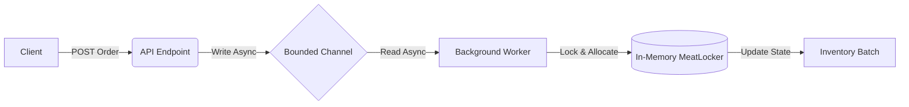

# 🥓 FreshStream (The "Baconator" API)
**High-Volatility Perishable Inventory Management Engine**

**Baconator** is a .NET 9 distributed systems proof-of-concept designed to solve a specific enterprise challenge: **managing high-velocity, shifting inventory datasets without relying on throughput-killing pessimistic locks.** This project simulates a high-volume perishable goods environment (2 million pounds of inventory across 2,000 pallets) where the "Ground Truth" of the warehouse floor is constantly mutating due to physical telemetry (spoilage, scale recalibrations, dropped boxes). It demonstrates how to maintain strict data integrity and **FEFO (First-Expired, First-Out)** allocation rules under massive concurrent load.

## 🎯 The Problem
In food processing, standard inventory algorithms (FIFO/LIFO) could arguably result in spoilage (and therefore revenue loss). Additionally, during high-volume sales events, synchronous API processing can cause race conditions where inventory is oversold (two orders coming in at exactly the same time for limited inventory could create an oversell, e.g. two orders for 50lbs of inventory, when **only** 50lbs remain).

## 💡 The Solution
**Baconator** is an asynchronous backend service that decouples **Order Ingestion** from **Inventory Processing**.
* **Zero-Blocking:** The API accepts orders instantly (`202 Accepted`) and offloads processing to a background worker.
* **Spoilage Reduction:** Implements a **FEFO algorithm** to automatically allocate the oldest valid inventory first.
* **Thread Safety:** Implements in-memory ACID transaction logic via rigorous locking, ensuring that availability checks and inventory deductions occur as an atomic operation.

---

## 🏗 Architecture

The system utilizes a **Producer/Consumer** pattern using `System.Threading.Channels` to handle backpressure and ensure API stability.


```mermaid
graph LR
    A[Client] -- POST Order --> B(API Endpoint)
    B -- Write Async --> C{Bounded Channel}
    C -- Read Async --> D[Background Worker]
    D -- Lock & Allocate --> E[(In-Memory MeatLocker)]
    E -- Update State --> F[Inventory Batch]
```

## Core Architectural Patterns

* **Optimistic Concurrency Control:** Replaces traditional database/collection locking. The system calculates complex, multi-pallet allocations in memory and utilizes `Version` tracking to detect if the underlying data mutated during calculation. If a collision occurs, the system gracefully aborts, re-queries the ground truth, and retries without dropping the order.
* **Event-Driven Bounded Channels:** API requests are offloaded to an in-memory `System.Threading.Channels` queue to provide immediate backpressure and protect downstream systems from traffic spikes.
* **Asynchronous Background Processing:** A dedicated hosted service worker processes the queue, decoupling the web request lifecycle from the inventory allocation logic.
* **Abstracted Data Seeding:** Warehouse initialization is cleanly decoupled via the `InventorySeeder`, allowing the mock data engine to be seamlessly swapped for a live ERP database connection (at "some" point) via Dependency Injection.

## The Wee Beastie of a Service: `ChaosMonkey`
To prove the resilience of the Optimistic Concurrency model, this project includes a built-in "Red Team" testing engine. 

The `ChaosMonkey` runs as an active background process alongside the API. Every 150ms, it targets the oldest pallets in the warehouse and injects realistic telemetry variance (+/- 30 lbs). This simulates real-world physical warehouse chaos occurring at the exact millisecond the sales API is attempting to allocate that same inventory. The system must catch these micro-mutations and prevent the allocation of "Ghost Inventory."

---

## 🚀 Getting Started

Follow these steps to get the application running on your local machine.

### Prerequisites
* **.NET 9 SDK** (or newer)
* **Git**
* **PowerShell** (Optional: Required only if you want to run the automated stress test)

### Installation & Setup

1. **Clone the Repository**
   Open your terminal and run the following command to download the code:
   ```bash
   git clone [https://github.com/skycodepilot/Baconator.git](https://github.com/skycodepilot/Baconator.git)
   cd Baconator
   ```

2. **Restore Dependencies & Build**
   Pull down the necessary NuGet packages and compile the solution:
   ```bash
   dotnet restore
   dotnet build
   ```

3. **Run the API**
   Navigate to the API project folder and start the server:
   ```bash
   cd Baconator.Api
   dotnet run
   ```
   *The API will start listening. Look for the port number in the terminal output (usually `http://localhost:5xxx`).*

---

## The Architecture

### 1. `MeatLocker` (The Domain Store)
Manages the state of the warehouse. Implements the version-checking commit logic. It reads a snapshot, calculates the FEFO distribution across multiple pallets, and performs a microsecond lock only at the moment of the version-check and commit.

### 2. `BaconWorker` (The Consumer)
Listens to the Bounded Channel. Dequeues order requests and attempts to fill them via the `MeatLocker`. If the Locker reports a concurrency conflict (due to the Chaos Monkey), the Worker logs the collision and recursively retries until the transaction is cleanly committed.

### 3. `MockInventorySeeder` (The Environment)
Initializes the `MeatLocker` on startup with 2,000 distinct `PorkBatch` records (1,000 lbs each) with randomized suppliers and staggered expiration dates to force the FEFO logic to span multiple records per order.

## Running the Stress Test

The repository includes a PowerShell stress test designed to force temporal overlap and trigger concurrency conflicts. 

**Test Parameters:**
* **Initial State:** 2,000,000 lbs of inventory.
* **Volatility:** `ChaosMonkeyService` active (150ms strike rate).
* **Load:** 300 concurrent HTTP POST requests.
* **Order Size:** 1,500 lbs per request (forcing multi-pallet allocations).

**Execution:**
1. Run the .NET API (`dotnet run`). Wait for the `[SYSTEM] Warehouse seeded...` confirmation.
2. Execute `stress-test.ps1` from your terminal.
3. Observe the API console. You will see the standard allocations processing, interspersed with `[ALERT] Concurrency conflict...` warnings as the system successfully detects floor mutations, rejects the stale calculation, and auto-recovers. (Bear in mind concurrency conflicts with "nominal" latencies are **fairly rare**, and there is a chance you won't see any with existing parameters / tolerances. **If you really want to see the chaos monkey mess with the code, change the monkey's task delay from 150ms to 10ms to see concurrency conflict recovery way more often.**)

## Business Value
Traditional legacy ERP systems often suffer from "operational gravity"—they require total system locks to process large orders, leading to massive database bottlenecks. By utilizing Bounded Channels for backpressure and Optimistic Concurrency for data integrity, this architecture protects the parent ecosystem from crashing during sales surges while maintaining absolute inventory accuracy in a volatile physical environment.


### Other Options: Manual Testing (Swagger UI)
If running in a Development environment, you can use the Swagger UI:
1.  Open your browser to `http://localhost:5xxx/swagger`.
2.  Use **POST /api/inventory** to add stock.
3.  Use **POST /api/orders** to place orders.
4.  Use **GET /api/inventory** to see the real-time FEFO logic in action.

---

## 🧪 Unit Testing
The solution includes a Unit Test suite to verify the FEFO (First Expired, First Out) logic ensures older inventory is always prioritized.

To run the tests:
```bash
cd ../Baconator.Tests
dotnet test
```

---

## 🧠 Design Decisions & Trade-offs

### Why `System.Threading.Channels`?
Instead of an external message broker (RabbitMQ/Kafka), I used in-memory Channels for this micro-service to minimize infrastructure overhead while maintaining strict ordering and backpressure handling. This prevents `OutofMemory` exceptions if the API is flooded.

### Why `lock` over `ConcurrentBag`?
While concurrent collections are faster for simple adds, our business logic requires a **transactional** check: *Check total availability -> Sort by Date -> Deduct*. This multi-step operation must be atomic. A standard `lock` ensures that no two orders can read the inventory state simultaneously, preventing overselling.

### The "Artificial Delay"
The `BaconWorker` includes a simulated 100ms delay (`Task.Delay(100)`). This is intentional to demonstrate the **Decoupling** capability. You will observe the API accepting requests instantly while the worker processes them at its own pace in the background. (Other artificial delays have been introduced and exist to simulate / emulate network latency.)

### Wait - You Wrote This in LINUX?!?!
It's relatively straightforward to write apps like this inside Visual Studio. I used Pop! OS Linux as my operating system and VSCodium as my IDE, leveraging the terminal to do things like creating projects, adding packages, and running Git.